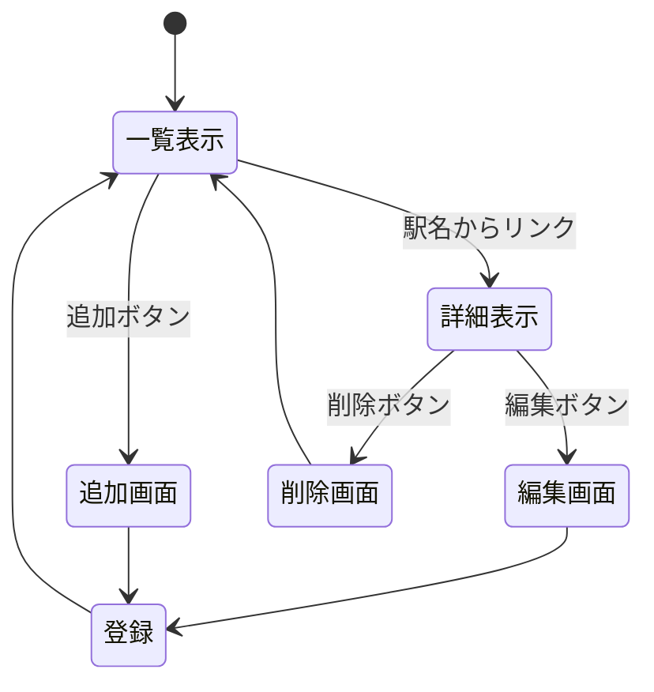

# Markdownの書式説明

## 基本書式

### 見出し

行頭に`#`を付けると大見出し（文章中に1つだけ）を作ることができる．
`#`を増やすと，中見出し，小見出しのようになり，仕様上では最大6個まで付けることができる．以下に例をに示す．

```text
# 大見出し（文章タイトル）
## 中見出し（節タイトル）
### 小見出し（項タイトル）
```

### 文字飾り

強調や斜体など，様々な装飾をつけることができる．以下に例を示す．

装飾 | 書式 | 使用例 | 出力例
-|-|-|-
太字 | ** ** | `**Bold**` | **Bold**
太字 | __ __ | `__Bold__` | __Bold__
斜体 | * * | `*Italic*` | *Italic*
斜体 | _ _ | `_Italic_` | _Italic_
打ち消し | ~~ ~~ | `~~打ち消し~~` | ~~打ち消し~~
打ち消し | ~ ~ | `~打ち消し~` | ~打ち消し~
太字+斜体 | *** *** | `***Bold and Italic***` | ***Bold and Italic***
下付き | `<sub> </sub>` | 通常`<sub>下付き</sub>`通常 | 通常<sub>下付き</sub>通常
上付き | `<sup> </sup>` | 通常`<sup>上付き</sup>`通常 | 通常<sup>上付き</sup>通常
下線 | `<ins> </ins>` | `<ins>下線</ins>` | <ins>下線</ins>

## コード表記

### 文章中のコード

文章中のキーワードを\`で挟むとコードを表す．例えば，「`git`コマンドを使用する」のようにコードやコマンドを表す表現になる．

### 引用
行頭に>を書くと，その行は引用を表す．複数行に対応している．
例を以下に示す．1行目が使用例で2行目が出力となっている．
`> 引用内容`
> 引用内容

### コードブロック

複数行にわたるコードやコマンドなどはコードブロックを使用して表記する．書式としては，行頭に\```を書き，改行してコードを書く．終了も\```である．
行頭の\```の後ろに言語名を書くと，言語ごとの予約語などに色を付けて表示できる．言語名には`C`，`html`，`javascript`，`mermaid`，`text`などを使用できる．
使用例はこの文章のソースコードを見ること．

```C
#include <stdio.h>
int main() {
    ・・・中略・・・
    return 0;
}
```

## リンク

### 外部Webサイトへのリンク

文中に，外部Webサイトへのリンクを付ける場合は，`[`と`]`で囲まれた中にリンクテキストを書き，続けて`(`と`)`の中にリンク先のURLを書く．使用例とその出力を以下に示す．

```html
検索は[Google](https://www.google.com)を使用すると良い．
```

検索は[Google](https://www.google.com)を使用すると良い．

### サイト内リンク

別のMarkdownファイルなどにリンクを付けることもできる．その場合，上記のURLの部分にファイル名を書いておく．使用例と出力を以下に示す．

```html
READMEへの[リンク](README.md)
```

READMEへの[リンク](README.md)

### 画像の表示

`サイト内リンク`とほぼ同じ仕組みで画像ファイルを挿入することができる．異なるのは，`[`の前に`!`を付けることである．使用例と出力を以下に示す．

```html

```


## 箇条書き

### 通常の箇条書き
行頭に`- `や`* `や`+ `を書くと箇条書きになる．使用例と出力を以下に示す．

```text
- 西船橋
- 船橋
- 東船橋
```

- 西船橋
- 船橋
- 東船橋

### 番号付き箇条書き
行頭に`数字.`を書くと番号付き箇条書きになる．数字は1行目だけ意味があり，それ以降は順次+1される．1行目の数字が先頭の数字になる．使用例と出力を以下に示す．

```text
1. 浦和
1. 西浦和
1. 東浦和
1. 北浦和
1. 南浦和
```

1. 浦和
1. 西浦和
1. 東浦和
1. 北浦和
1. 南浦和

## その他

### 絵文字

Githubでは，様々な絵文字が用意されており，`:smile:`のように書くと:smile:が表示される．ポイントを絞って使用するとドキュメントが分かりやすくなる．ただし，多用すると逆効果になるので，使用する場合は注意すること．
絵文字の種類は[絵文字チートシート](https://github.com/ikatyang/emoji-cheat-sheet/blob/github-actions-auto-update/README.md)を参照すること．


### タスクリスト

行う作業を整理するために，タスクリストを作成できる．
詳しいことはこのページのソースコードを参照すること．

- [ ] 開発者向けドキュメントの作業
  - [x] 対象とするシステムの決定 :thinking:
  - [ ] データ構造の決定 :thinking:
  - [ ] ページ構造の検討 :thinking:
  - [ ] ページ遷移の検討 :thinking:
  - [ ] HTTPメソッドとリソース名の決定
  - [ ] ページ遷移図の作成 :writing_hand:
  - [ ] ページ構造の決定
  - [ ] ドキュメントの構成の検討 :thinking:
  - [ ] 概要 :writing_hand:
  - [ ] HTTPメソッドとリソース名一覧 :writing_hand:
  - [ ] データ構造 :writing_hand:
  - [ ] リソース名ごとの機能の詳細 :writing_hand:
- [ ] 管理者向けドキュメントの構成
  - [ ] インストールから起動までの手順確認 :computer:
  - [ ] インストール方法 :writing_hand:
  - [ ] 起動方法 :writing_hand:
  - [ ] 起動できない場合 :writing_hand:
  - [ ] 終了方法 :writing_hand:
  - [ ] 分かっている不具合 :writing_hand:
- [ ] 利用者向けドキュメントの作業
  - [ ] 構成の検討 :thinking:
  - [ ] スクリーンショットの保存と整理 :computer:
  - [ ] 概要 :writing_hand:
  - [ ] 使用できる機能 :writing_hand:
  - [ ] 起動画面 :writing_hand:
  - [ ] 一覧表示 :writing_hand:
  - [ ] 詳細表示 :writing_hand:
  - [ ] データ追加 :writing_hand:
  - [ ] データ削除 :writing_hand:
  - [ ] データ編集 :writing_hand:
- [ ] 提出 :tada:

### Mermaid

すでに授業で紹介している，Mermaidによる図も使用できる．
簡単な図しか描画できないが編集が簡単なので，設計・検討段階に下書きツールとして使用すると良い．
